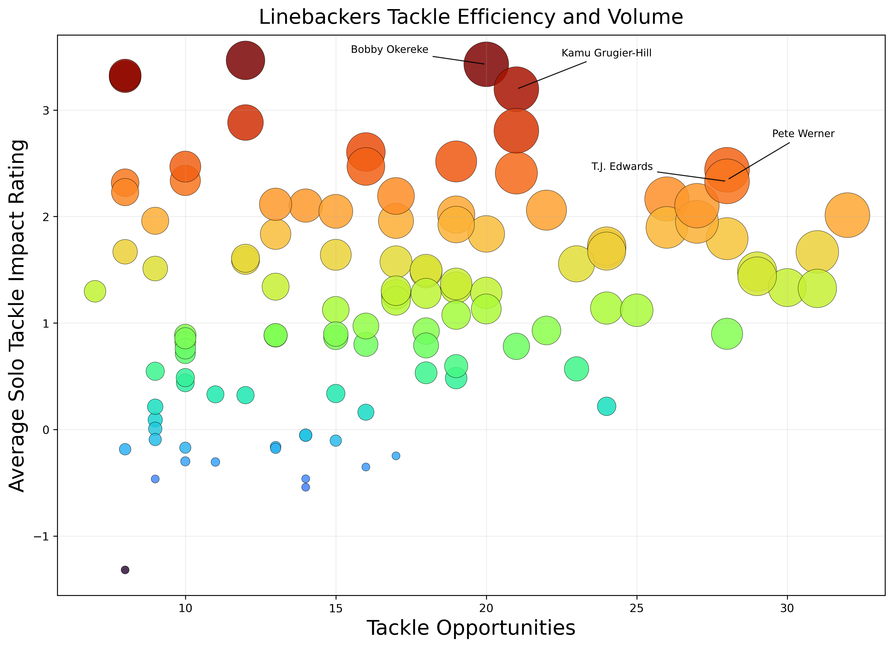
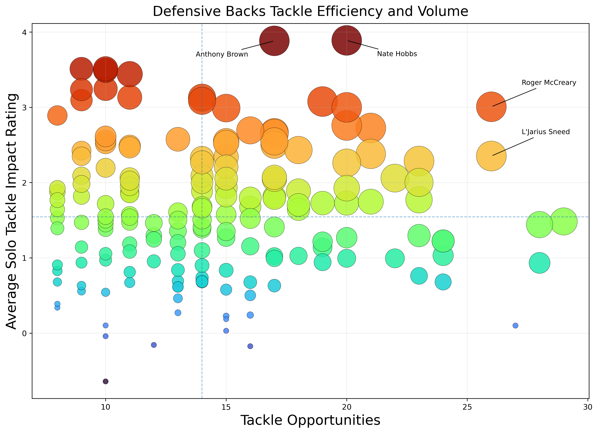
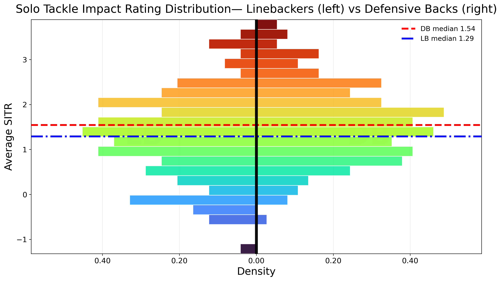

# NFL Big Data Bowl 2024 — Tackle Efficiency

**Solo Tackle Impact Rating (STIR)** is a custom metric designed to measure the *impact and efficiency* of a defender’s solo tackles.  
Instead of only counting raw tackles, STIR adjusts for context — such as tackle probability, opportunity, and field impact — to better capture how much a player truly contributes when making a stop.  

This repository explores STIR across defensive positions (Linebackers, Defensive Backs, and Defensive Linemen) using data from Weeks 5–9 of the 2024 NFL season.  
It includes curated datasets, reproducible figures, and an isolated third-party animation notebook for play visualization.  

---

## Example Results

Linebackers — Efficiency vs Volume  


Defensive Backs — Efficiency vs Volume  


Linebackers vs Defensive Backs — Distribution Comparison  


---

## Highlights
- Curated position datasets:  
  - `results/db_df.csv`  
  - `results/dl_df.csv`  
  - `results/lb_df.csv`
- Reproducible figures via `src/make_figures.py`
- Core analysis in `notebooks/01_analysis.ipynb`
- Third-party animation notebook under `notebooks/third_party/` with attribution

---

## Quick Start

Using Conda:

```bash
conda env create -f environment.yml
conda activate nfl-bdb-2024
python src/make_figures.py


